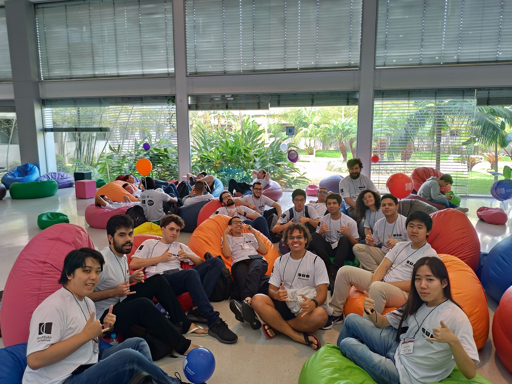
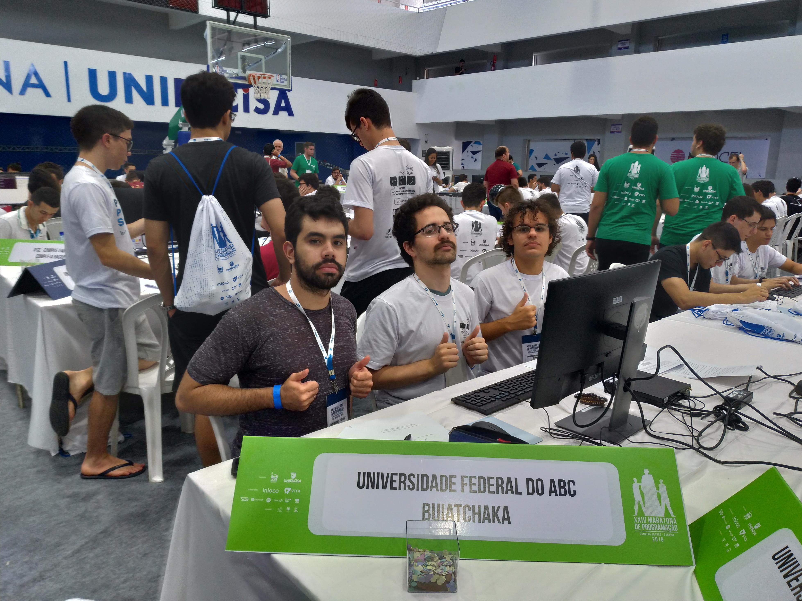

Esse é o histórico anual da GRUB a partir da sua fundação!

## 2019

### Etapa Regional

Foto em grupo dos estudantes que participaram da Maratona de Programação em 2019

**Times da UFABC participantes**

| Nome             | Integrantes                                                  | Técnico                    |
| ---------------- | ------------------------------------------------------------ | -------------------------- |
| buiatchaka       | Bryan Batista Valeriano  Jonatas Duarte Souza Wesley Pereira da Silva Michel Munhoz (reserva) | Prof.ª Dra. Cristiane Sato |
| Stranger Strings | Robert Chinem Fujii  Pedro Ives Silva Santos Daniel Mendes Vale de Sá Marcos Baldrigue Andrade (reserva) | Prof.ª Dra. Cristiane Sato |
| C_MinusMinus     | William de Souza Gomes  Matheus Costa Damasceno Dimitri Leandro de Oliveira Silva Karoliny dos Anjos Pereira Alves (reserva) | Prof.ª Dra. Cristiane Sato |
| Balão Mágico     | Pedro de Souza Tunin Leonardo Ryo Nakagawa Edson Eidi Hossotani Paulo Henrique Moura Rocha (reserva) | Prof.ª Dra. Cristiane Sato |
| Coda Raul        | Bryan Bialokur da Cruz Bruno Menezes Gottardo Ladeia Igor Neres Trindade Filipi de Carvalho Brabo (reserva) | Prof.ª Dra. Cristiane Sato |
| Quero Café ++    | Nathalia Favero Amorim Thales Cunha da Paixão André Yuji Sakuma Flavia Sampaio dos Santos (reserva) | Prof.ª Dra. Cristiane Sato |

**Classificação no Brasil**

Dados segundo o [site da maratona de programação](http://maratona.ime.usp.br/primfase19/reports/ScoreBrasil.html):

| Equipe           | Regional (Total = 726) |
| ---------------- | :--------------------: |
| buiatchaka       |          36º           |
| Stranger Strings |          176º          |
| C_MinusMinus     |          247º          |
| Balão Mágico     |          324º          |
| Coda Raul        |          400º          |
| Quero Café ++    |          472º          |

### Final Brasileira

| Equipe     | Final Brasileira (Total = 57) |
| ---------- | :---------------------------: |
| buiatchaka |              31º              |

Time "buiatchaka" classificado para a Final Nacional 2019, ficando na 31º posição. Da esquerda para a direita: Bryan Batista Valeriano, Jonatas Duarte Souza e Wesley Pereira da Silva.

## 2018

### Etapa Regional

Foto em grupo dos estudantes que participaram da Maratona de Programação em 2018

**Times da UFABC participantes**

| Nome                | Integrantes                                                  | Técnico                    |
| ------------------- | ------------------------------------------------------------ | -------------------------- |
| lupa linda          | Bryan Batista Valeriano  Vinícius Veronese Gonçalves Wesley Pereira da Silva Daniel Escudero (reserva) | Prof.ª Dra. Cristiane Sato |
| vimc++              | Bryan Bialokur da Cruz Jonatas Duarte Souza Bruno Menezes Gottardo Ladeia Filipi de Carvalho Brabo (reserva) | Prof.ª Dra. Cristiane Sato |
| a.out               | Caio Cesar Ramalho Follador  Vitor Costa de Farias  Pedro de Souza Tunin Melissa Kelly Lima da Silva (reserva) | Prof.ª Dra. Cristiane Sato |
| I'm not your father | Renata dos Santos Silva Paes William de Souza Gomes Nicholas Gobetti Oshiro Kleverson Nascimento Pinto (reserva) | Prof.ª Dra. Cristiane Sato |

**Classificação no Brasil**

Dados segundo o [site da maratona de programação](http://maratona.ime.usp.br/hist/2018/):

| Equipe              | Regional (Total = 803) |
| ------------------- | :--------------------: |
| lupa linda          |          122º          |
| vimc++              |          274º          |
| a.out               |          454º          |
| I'm not your father |          549º          |

### Final Brasileira

| Equipe     | Final Brasileira (Total = 71) |
| ---------- | :---------------------------: |
| lupa linda |              28º              |

Time "lupa linda" classificado para a Final Nacional 2018, ficando na 28º posição. Da esquerda para a direita: Bryan Batista Valeriano, Jonatas Duarte Souza e Wesley Pereira da Silva.
