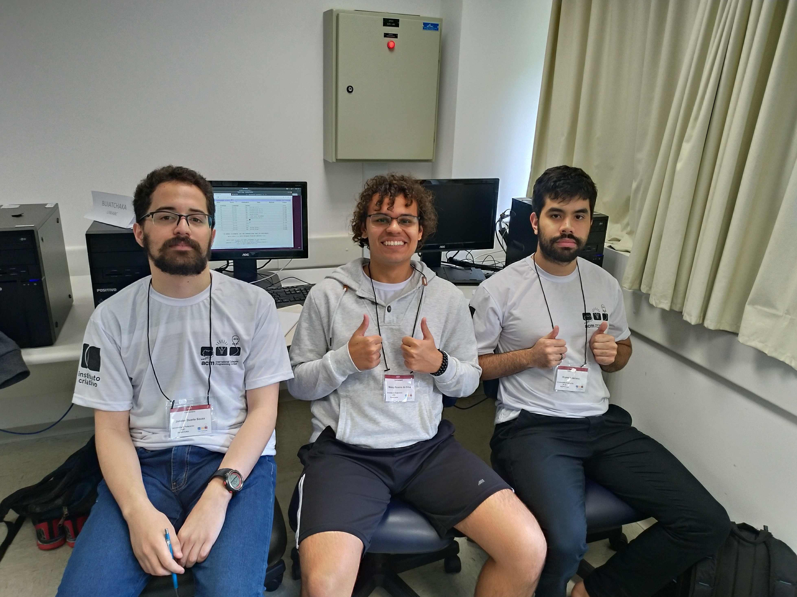
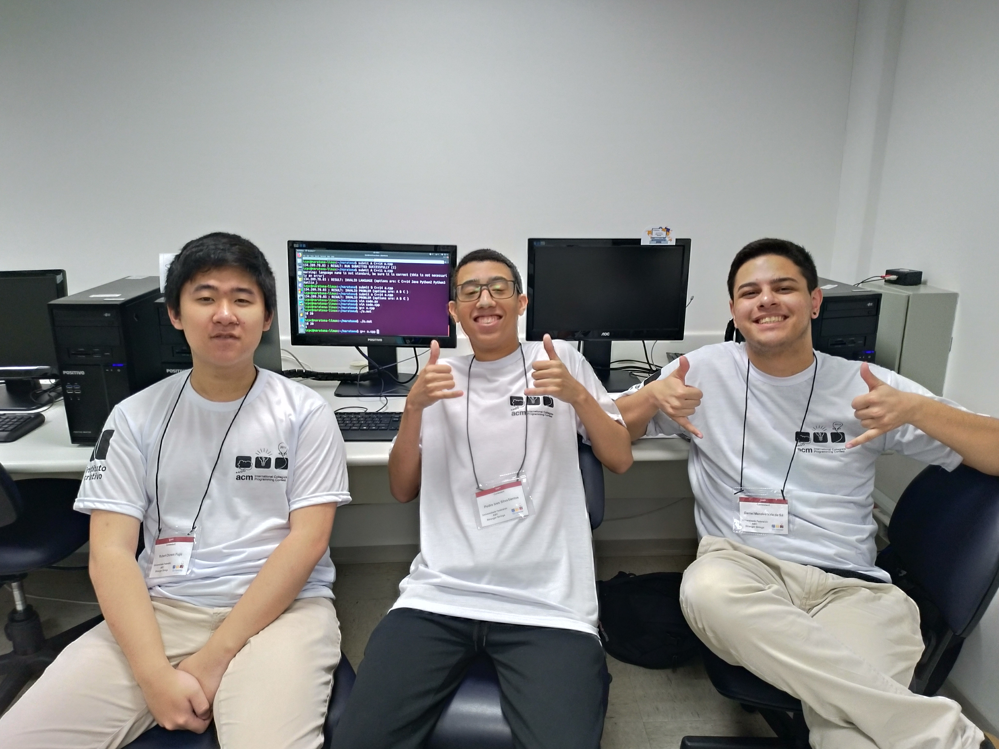
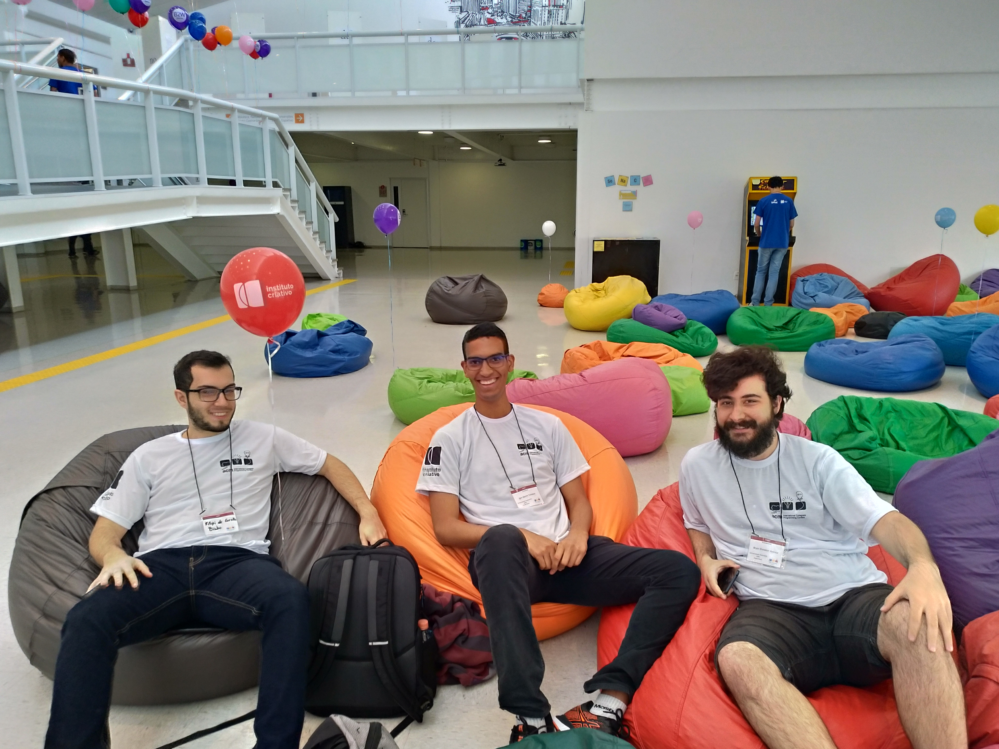
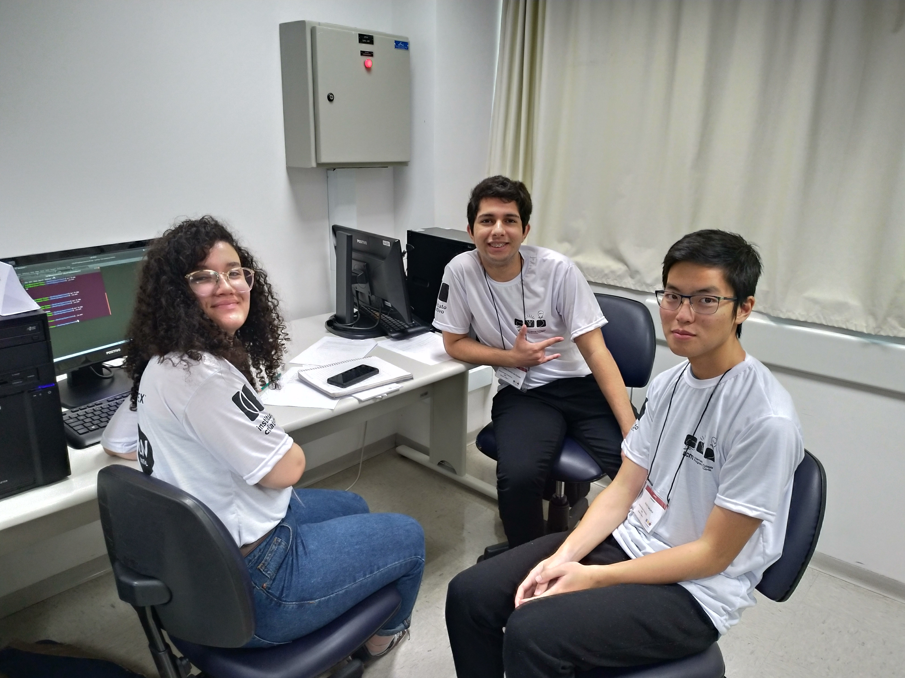

No dia 14 de Setembro de 2019 ocorreu a 24a. edição da Maratona SBC de Programação. Junto com ela veio uma ótima notícia: conseguimos classificar uma equipe para a etapa Final Brasileira, que acontecerá na Paraíba!!

Nessa primeira fase participaram mais de 700 equipes ao longo de todo o Brasil, sendo classificadas aproximadamente 70 delas para a etapa Nacional, que acontecerá em Campina Grande - Paraíba.

# Equipes participantes

## buiatchaka 

Time formado por Jonatas, Wesley e Bryan. 

Realizando 7 problemas, com 1087 de penalidade, obtiveram 36a. colocação no Brasil e a 4a. colocação na sede de São Paulo (nossa melhor posição até hoje), classificando-se para a Final Brasileira em Campina Grande - Paraíba.

## Stranger Strings 

Time formado por Robert, Pedro e Daniel. 

Realizando 2 problemas, com 46 de penalidade, obtiveram 176a. colocação no Brasil e a 8a. colocação na sede de São Paulo.

## C_MinusMinus 

Time formado por William, Dimitri e Matheus. 

Realizando 2 problemas, com 74 de penalidade, obtiveram 248a. colocação no Brasil e a 10a. colocação na sede de São Paulo.

## Balão Mágico

Time formado por Leonardo, Edson e Pedro. 

Realizando 2 problemas, com 113 de penalidade, obtiveram 345a. colocação no Brasil e a 12a. colocação na sede de São Paulo.

## Coda Raul

Time formado por Filipe, Igor e Bryan. 

Realizando 2 problemas, com 178 de penalidade, obtiveram 401a. colocação no Brasil e a 16a. colocação na sede de São Paulo.

## Quero Café++

Time formado por Nathalia, Thales e André. 

Realizando 2 problemas, com 316 de penalidade, obtiveram 475a. colocação no Brasil e a 19a. colocação na sede de São Paulo.

# Agradecimentos

Todas as equipes estão de parabéns!
Um muito obrigado a todos que participaram e um agradecimento especial à nossa treinadora, a Profa. Dra. Cristiane Sato, ela é demais!

# Links

- [Placar final no Brasil](http://maratona.ime.usp.br/primfase19/reports/ScoreBrasil.html)
- [Classificados para a Final Brasileira 2019](http://maratona.ime.usp.br/vagas19.html)

